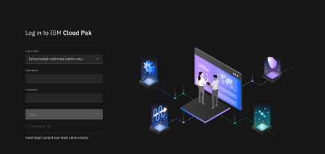
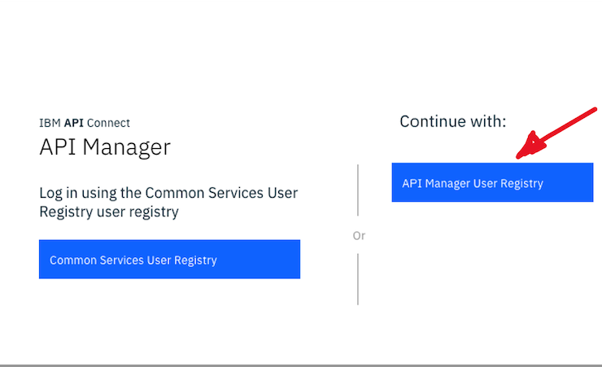
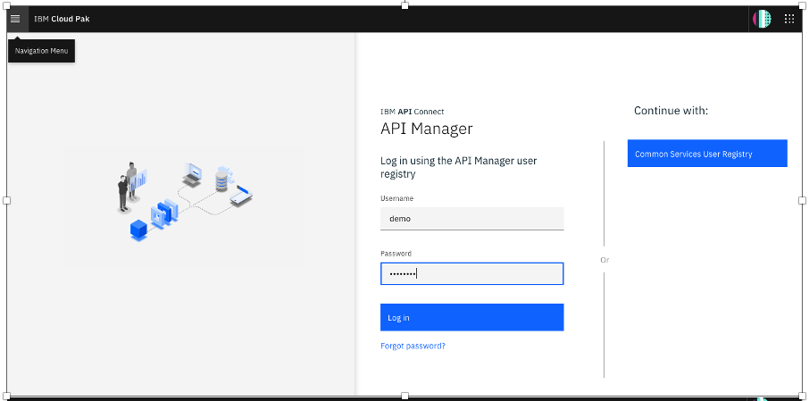

### [Return to main APIC lab page](../api-connect)

---

# Table of Contents
1. [Objectives](#objectives)
2. [Prerequisites](#prerequisites)
3. [Getting started with Lab1](#deploy)

   1. [Import an API into the Developer Workspace](#import_api)

   2. [Configure the API ](#configure_api)  
      i. [Configure API Key Security](#configure_security)  
      ii. [Define a Target-URL for Sandbox Environment](#target_url)  
      iii. [Configure Proxy Call in Designer](#proxy)  

   4. [Test the API](#test_api)

   5. [Publish API](#publish_api)  
      i. [Create Customer Product and Add API](#customer_product)

---

## 1. Objectives <a name="objectives"></a>

In this lab you will learned how to:

-   Create an API by importing an OpenAPI definition for an existing REST service.

-   Configure ClientID/Secret Security, endpoints, and proxy to invoke endpoint.

-   Test a REST API in the Developer Toolkit.

-   Publish an API for developers.

## 2. Prerequisites <a name="prerequisites"></a>

- Reserve the lab environment. If you have not reserved the lab environment yet, then click [[here](https://techzone.ibm.com/collection/jam-in-a-box-for-the-integration-automation-cp4i/environments)]

- Create **Provider Organization** and Configure **Developer portal**. Go through [FAQs](https://ibmintegration.github.io/jam-in-a-box/faq)

- Go through the audio presentation to get the knowledge about API connect capabilities. Cleck [here](https://ibm.box.com/s/zdvlrkbmobejvkd5hzhiqf7jur4fc6sj)


## 3. Getting started with lab1 <a name="deploy"></a>

Before we can use API Connect we must publish an API to expose. We will deploy a Customer Database REST service and then we will download the OpenAPI file for the the Customer Database REST service that we deployed.

1\. In a browser, enter the URL for the Platform Navigator. Go to [FAQs](https://ibmintegration.github.io/jam-in-a-box/faq#TZ-ocp-console) to learn, how to access your enviroment.

2\. When prompted, use the username(admin) and password provided to you for this lab.



4\. When you log in for the first time, you may see a **Welcome, let's get started** window.  Feel free to review the contents by click **Start the tour** or by click on the **X** to close the window.

![alt text][pic91]

5\. Navigate to the **App Connect Dashboard**.

![alt text][pic92]

6\. Click on the **Dashboard** icon in the left navigation.

![alt text][pic93]

7\. If you would like to create this web service yourself, follow the instructions in the **Using a REST API to manage a set of records** tutorial (https://www.ibm.com/docs/en/app-connect/11.0.0?topic=enterprise-toolkit-tutorials-github).  Otherwise, you can download the **CustomerDatabaseV1.bar** file for the service [here](./resources/CustomerDatabaseV1.bar).

8\. Click on **Create server**.

![alt text][pic94]

9\. Click **Quick start toolkit integration** and click **Next**.

![alt text][pic95]

10\. Drag and drop the BAR file that you just downloaded or click to upload.  Click **Next**.

![alt text][pic96]

11\. Click **Next**.

![alt text][pic97]

12\. Give the Integration Server a **Name** (e.g. <span style="color: red">username</span>-customerdb) and click **Create**.

![alt text][pic98]

13\. This will take you back to the Servers Dashboard where you will see your new server. It will likely be showing Pending while it is starting up the pod.

![alt text][pic99]

14\. Note: It may take a couple of minutes to start up. You can refresh the page. Once it is up and running it will show the following:

![alt text][pic100]

15\.  Click on the newly created Integration Server.

![alt text][pic101]

16\. Click on the **CustomerDatabaseV1** API.

![alt text][pic102]

17\. Confirm that the **Overview** tab is selected and click **Download OpenAPI Document**.

![alt text][pic103]

[pic0]: images/0.png
[pic1]: images/1.png
[pic2]: images/2.png
[pic3]: images/3.png
[pic4]: images/4.png
[pic5]: images/5.png
[pic91]: images/91.png
[pic92]: images/92.png
[pic93]: images/93.png
[pic94]: images/94.png
[pic95]: images/95.png
[pic96]: images/96.png
[pic97]: images/97.png
[pic98]: images/98.png
[pic99]: images/99.png
[pic100]: images/100.png
[pic101]: images/101.png
[pic102]: images/102.png
[pic103]: images/103.png

## 3a. Import an API into API Connect <a name="import_api"></a>

1\. Click on **IBM Automation** in the upper left.

![alt text][pic104]

2\. Navigate to the API Connect instance.

![alt text][pic6]

3\. Select API Manager User Registry.



4\. Use the user name and password that you have created while creating the provider organization. Refer FAQs section 5)k).



5\. When you log in for the first time, you may see a **Get started** window.  Feel free to review the contents and close the window.

6\. Confirm that you are in the provider organization for your username (upper right) and then click on **Develop APIs and products**.

![alt text][pic9]

7\. We are now able to begin to create APIs and Products.  Click **Add**.

![alt text][pic10]

8\. Click **API (from REST, GraphQL or SOAP)**.

![alt text][pic11]

9\. Click **Existing OpenAPI** under **Import** and click **Next**.

![alt text][pic12]

10\.  Select the **Customer_Database-1.0.0.yaml** file that was just downloaded and click **Next**.

![alt text][pic13]

11\. Make sure that the **Activate API** <span style="color: red">is not</span> selected and click **Next**. 

![alt text][pic14]

12\.  The API should be imported successfully as shown in the image below.  Click **Edit API**.

![alt text][pic15]

[pic6]: images/6.png
[pic7]: images/7.png
[pic8]: images/8.png
[pic9]: images/9.png
[pic10]: images/10.png
[pic11]: images/11.png
[pic12]: images/12.png
[pic13]: images/13.png
[pic14]: images/14.png
[pic15]: images/15.png
[pic104]: images/104.png

## 3b. Configure the API <a name="configure_api"></a>

After importing the existing API, the first step is to configure basic security before exposing it to other developers. By creating a client key and secret security, we are able to identify the application using the API.

Next, we will define the backend endpoints where the API is actually running. IBM API Connect supports pointing to multiple backend endpoints to match your multiple build stage environments.

Finally, we will configure the proxy call to invoke the endpoint.

### i. Configure API Key Security <a name="configure_security"></a>

1\. Upon import, you will notice that an error has been detected.  Click on the **error**.

![alt text][pic16]

2\. The error indicates that **the openapi definition must contain the 'https' scheme.**.  After reviewing the error, click on the **X** to close the window.

![alt text][pic17]

3\. To resolve the error, make sure that the **Design** tab is selected and click on the **+** next to **Schemes List**.

![alt text][pic18]

4\. From the **Select an option** drop-down menu, select **https**.  Click **Create**.

![alt text][pic19]

![alt text][pic20]

5\. Expand the **Schemes List** section.  Under the Schemes List, **http** and **https** are listed.  Click **Save**.

![alt text][pic21]

Once saved, you will see an indicator window appear that shows that **Your API has been updated**.  Click on the **X** to close the window.  You should no longer see the warning indicator.

![alt text][pic22]

6\. Make sure that the **Design** tab is selected and click on the **+** next to **Security Schemes**.

![alt text][pic23]

7\. For the **Security Definition Name (Key)**, enter a name (e.g., **X-IBM-Client-Id**) and select **apiKey** in the drop-down menu for **Security Definition Type**.

![alt text][pic24]

8\. For the **Name**, enter a name (e.g., **X-IBM-Client-Id**), select **client_id** from the drop-down menu for **Key Type (optional)**, and select **header** from the drop-down menu for **Located In**.  Click **Create**.

![alt text][pic25]

9\. Click **Save**.

![alt text][pic26]

10\. Once saved, you will see an indicator window appear that shows that **Your API has been updated**.  Click on the **X** to close the window.

![alt text][pic22]

11\. Make sure that the **Design** tab is selected and click on the **+** next to **Security Schemes**.

![alt text][pic31]

12\. For the **Security Definition Name (Key)**, enter a name (e.g., **X-IBM-Client-Secret**) and select **apiKey** in the drop-down menu for **Security Definition Type**.

![alt text][pic32]

13\. For the **Name**, enter a name (e.g., **X-IBM-Client-Secret**), select **client_secret** from the drop-down menu for **Key Type (optional)**, and select **header** from the drop-down menu for **Located In**.  Click **Create**.

![alt text][pic33]

14\. Click **Save**.

![alt text][pic26]

15\. Once saved, you will see an indicator window appear that shows that **Your API has been updated**.  Click on the **X** to close the window.

![alt text][pic22]

16\. Make sure that the **Design** tab is selected and click on the **+** next to **Security**.

![alt text][pic34]

17\. Select **"X-IBM-Client-Id"** and **"X-IBM-Client-Secret"** and click **Create**.

![alt text][pic35]

18\. Click **Submit**.

![alt text][pic37]

19\. Click **Save**.

![alt text][pic26]

20\. Once saved, you will see an indicator window appear that shows that **Your API has been updated**.  Click on the **X** to close the window.

![alt text][pic22]

### ii. Define a Target-URL for Sandbox Environment <a name="target_url"></a>

1\. Make sure that the **Design** tab is selected and click on **Host**.

![alt text][pic38]

2\. Copy the value in the **Host (optional)** field.

![alt text][pic39]

3\. Navigate to the **Gateway** tab.

![alt text][pic40]

4\. Make sure that the **Gateway** tab is selected and expand **Properties**.  Click on **target-url**.

![alt text][pic41]

5\. Replace the **Property Value (optional)** with the value that you copied in Step 2.  **Note:**  Make sure to include a **http://** at the beginning and remove the **:** and **port number** (e.g. **:80**) from the end if it exists.

![alt text][pic42]

6\. Click **Update**.

![alt text][pic43]

7\. Click **Save**.

![alt text][pic44]

8\. Navigate to the **Design** tab.

![alt text][pic45]

9\. Click on **Host**.

![alt text][pic46]

10\. Delete the value in the **Host (optional)** field.

![alt text][pic47]

11\. Click **Save**.

![alt text][pic26]

12\. Once saved, you will see an indicator window appear that shows that **Your API has been updated**.  Click on the **X** to close the window.

![alt text][pic22]

### iii. Configure Proxy Call in Designer <a name="proxy"></a>

1\. Navigate to the **Gateway** tab.

![alt text][pic48]

2\. Make sure the **Gateway** tab is selected and click on **Policies**.

![alt text][pic49]

3\. Click on the **Invoke** task in the assembly panel.

![alt text][pic50]

4\. Update the **URL** so that it reads **$(target-url)$(request.path)**.

![alt text][pic51]

5\. Click **Save**.

![alt text][pic52]

6\. Once saved, you will see an indicator window appear that shows that **Your API has been updated**.  Click on the **X** to close the window.

![alt text][pic53]

[pic16]: images/16.png
[pic17]: images/17.png
[pic18]: images/18.png
[pic19]: images/19.png
[pic20]: images/20.png
[pic21]: images/21.png
[pic22]: images/22.png
[pic23]: images/23.png
[pic24]: images/24.png
[pic25]: images/25.png
[pic26]: images/26.png
[pic27]: images/27.png
[pic28]: images/28.png
[pic29]: images/29.png
[pic30]: images/30.png
[pic31]: images/31.png
[pic32]: images/32.png
[pic33]: images/33.png
[pic34]: images/34.png
[pic35]: images/35.png
[pic36]: images/36.png
[pic37]: images/37.png
[pic38]: images/38.png
[pic39]: images/39.png
[pic40]: images/40.png
[pic41]: images/41.png
[pic42]: images/42.png
[pic43]: images/43.png
[pic44]: images/44.png
[pic45]: images/45.png
[pic46]: images/46.png
[pic47]: images/47.png
[pic48]: images/48.png
[pic49]: images/49.png
[pic50]: images/50.png
[pic51]: images/51.png
[pic52]: images/52.png
[pic53]: images/53.png

## 3c. Test the API <a name="test_api"></a>

In the API Designer, you have the ability to test the API immediately after creation in the Assemble view!

1\. Switch the toggle from Offline to Online. This step automatically publishes the API.

![alt text][pic54]

2\. You will see an indicator window appear that shows that **Your API has been updated**.  Click on the **X** to close the window.  You should see that the API is now Online.

![alt text][pic55]

3\. Click on the **Test** tab.

![alt text][pic56]

4\. For the **Request**, select the request that begins with **GET** and ends in **../customerdb/v1/customers**.  Click **Send**.

![alt text][pic57]

**Note:** If this is the first time testing the API after publishing it, you may get a **No response received** popup. Click **Here** and accept the certificate to see the 401 message.

![alt text][pic58]

To add an exception in the Chrome browser, click in the whitespace of the page.

![alt text][pic59]

Blindly type **thisisunsafe**.  This should direct you to a new page that states **401 - Unauthorized**.

![alt text][pic60]

Navigate back to the **API Connect** browser window.

To add an exception in the Firefox browser, click **Advanced** and click **Accept the Risk and Continue**.

![alt text][pic61]

![alt text][pic62]

This will direct you to a new page that states **401 - Unauthorized**.

![alt text][pic63]

Navigate back to the **API Connect** browser window.

5\. Click **Send**.

![alt text][pic57]

6\. The **Response** will show all of the customers in the database.

![alt text][pic64]

7\. Now let's add a record to the database.  Click **Clear**.

![alt text][pic65]

8\. For the **Request**, select the request that begins with **POST** and ends in **../customerdb/v1/customers**.  Click on the **Body** tab.

 ![alt text][pic66]

9\. In the **Body** tab, enter some text in the following JSON format:<br\>
```
{  
"firstname" : "Emily",  
"lastname" : "Drew",  
"address" : "123 Colorado Address"  
}  
```

Click **Send**.

![alt text][pic67]

10\. Make note of the **ID** number in the response.  In the example below, the ID is 9.

![alt text][pic68]

11\. For the **Request**, select the request that begins with **GET** and ends in **../customerdb/v1/customers/{customerId}** and click **Clear**.

![alt text][pic69]

12\. Click on the **Parameters** tab and enter the **ID** that you noted in step 10. Click **Send**.

![alt text][pic70]

13\. In the response, you will see the customer information that you entered in step 9.

![alt text][pic71]

14\. We can now update the customer information. For the **Request**, select the request that begins with **PUT** and ends in **../customerdb/v1/customers/{customerId}** and click **Clear**.

![alt text][pic72]

15\. Enter the **ID** that you noted in step 10 and click on the **Body** tab.

![alt text][pic73]

16\. In the **Body** tab, enter some text in the following JSON format:<br\>
```
{
  "firstname": "Emily",
  "lastname": "Drew",
  "address": "123 Colorado Address"
}
```
and click **Send**.

![alt text][pic74]

17\. The response should show that the customer ID was updated.

![alt text][pic75]

18\. For the **Request**, select the request that begins with **GET** and ends in **../customerdb/v1/customers/{customerId}** and click **Clear**.

![alt text][pic69]

19\. Make sure that the **Parameters** tab is selected and enter the **ID** that you noted in step 10. Click **Send**.

![alt text][pic70]

20\. In the response, you will see the customer information that you entered in step 16.

![alt text][pic76]

21\. You can also delete a customer from the customer database.  For the **Request**, select the request that begins with **DELETE** and ends in **../customerdb/v1/customers/{customerId}** and click **Clear**.

![alt text][pic77]

22\. Make sure that the **Parameters** tab is selected and enter the **ID** that you noted in step 10 and enter **secr3t** for **Authorization**. Click **Send**.

![alt text][pic78]

23\. In the response, you will see the customer was deleted.

![alt text][pic79]

[pic54]: images/54.png
[pic55]: images/55.png
[pic56]: images/56.png
[pic57]: images/57.png
[pic58]: images/58.png
[pic59]: images/59.png
[pic60]: images/60.png
[pic61]: images/61.png
[pic62]: images/62.png
[pic63]: images/63.png
[pic64]: images/64.png
[pic65]: images/65.png
[pic66]: images/66.png
[pic67]: images/67.png
[pic68]: images/68.png
[pic69]: images/69.png
[pic70]: images/70.png
[pic71]: images/71.png
[pic72]: images/72.png
[pic73]: images/73.png
[pic74]: images/74.png
[pic75]: images/75.png
[pic76]: images/76.png
[pic77]: images/77.png
[pic78]: images/78.png
[pic79]: images/79.png

## 3d. Publish API <a name="publish_api"></a>

In this lab, we will make the API available to developers. In order to do so, the API must be first put into a product and then published to the Sandbox catalog. A product dictates rate limits and API throttling.

When the product is published, the Invoke policy defined in the previous lab is written to the gateway. 

### 6a. Create Customer Product and Add API <a name="customer_product"></a>

1\. From the vertical navigation menu on the left, click **Develop**.

![alt text][pic80]

2\. Click the **Products** tab.

![alt text][pic82]

3\. Click **Add** and click **Product** from the drop-down menu.

![alt text][pic83]

![alt text][pic84]

4\. Click **New product** and click **Next**.

![alt text][pic85]

5\. Enter **Customer** for the **Title** and click **Next**.

![alt text][pic86]

6\. Select the **Customer Database** API and click **Next**.

![alt text][pic87]

7\. Keep the **Default Plan** as is and click **Next**.

![alt text][pic88]

8\. Select **Publish product** and confirm that **Visibility** is set to **Public** and **Subscribability** is set to **Authenticated**.  Click **Next**.

![alt text][pic89]

9\.  The Product is now published successfully with the API base URL listed and available for developers from the Developer Portal.  Click **Done**.

![alt text][pic90]

[pic80]: images/80.png
[pic81]: images/81.png
[pic82]: images/82.png
[pic83]: images/83.png
[pic84]: images/84.png
[pic85]: images/85.png
[pic86]: images/86.png
[pic87]: images/87.png
[pic88]: images/88.png
[pic89]: images/89.png
[pic90]: images/90.png


### [Return to main APIC lab page](../api-connect/)
