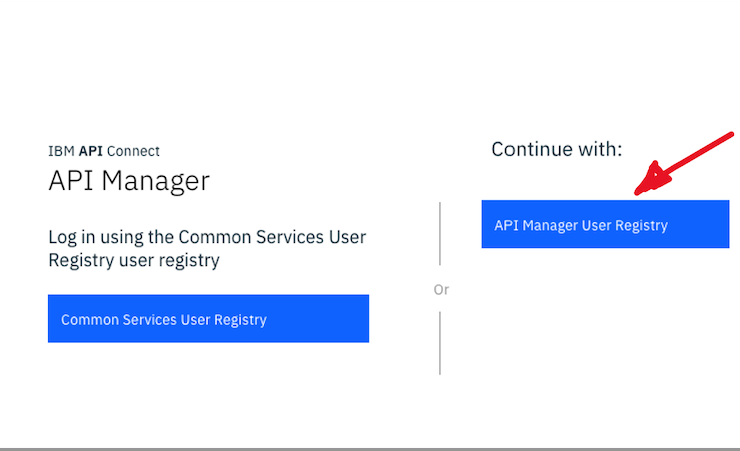

### [Return to main APIC lab page](../api-connect)

---

# Table of Contents
1. [Objectives](#objectives)
2. [Prerequisites](#prerequisites)
3. [Getting started with Lab2](#generate_portal)  
   1. [Login to the API Connect Developer Portal](#portal_login)
   
4. [Register a Test Application](#register_app)
   1. [Create a new Consumer Application](#consumer_app)
   
5. [Subscribe to the API Product](#subscribe_product)
   
6. [Test the API](#test_api) 

---

## 1. Objectives 

We will begin by creating a new catalog and configuring the Developer Portal for our Customer 1.0.0 Product. We will then define a new Plan in the Product and publish to our new Developer Portal.

In this lab, you will explore the following key capabilities:

-   Configure the Developer Portal and publish the APIs

-   Create a Portal Account

-   Create an application and subscribe to a Plan

-   Test the API in the Developer Portal

## 2. Prerequisites 

- Reserve the lab environment. If you have not reserved the lab environment, then click [here](https://techzone.ibm.com/collection/jam-in-a-box-for-the-integration-automation-cp4i/environments)

- Create Provider Organization and Configure Developer portal. Go through [FAQs](https://ibmintegration.github.io/jam-in-a-box/faq)

- Go through the audio presentation to get the knowledge about API connect capabilities. Click [here](https://ibm.box.com/s/dg7srpotmpljk7wkl6v5kmcqc0sw9gp6)

- Finish the Lab1. You will publish the REST API that you have created in the Lab1,

## 3. Getting started with Lab2 

A Developer Portal for the Sandbox catalog has already been configured in this environment. Refer FAQs.

### 2a. Login to the API Connect Developer Portal 

1\. In a browser, enter the URL for the Platform Navigator and use username(admin)/password that is provided to you.

2\. Navigate to the API Connect instance.

![alt text][pic6]

3\. Select API Manager User Registry.

4\. Use the user name and password that you have created while creating the provider organization. Refer FAQs section 5)k).

5\. Click on **Manage catalogs**.  If you are already logged in and continuing from the previous lab, click on the **Home** icon on the left navigation bar.

![alt text][pic9]

6\. Click on **Sandbox**.

![alt text][pic10]

7\. Select the **Catalog settings** tab.

![alt text][pic11]

8\. From the left menu, click on **Portal**.

![alt text][pic12]

9\. Copy the **Portal URL** and paste it in a new browser tab.

![alt text][pic13]

10\.  The IBM API Connect Developer Portal provides consumers access to API Catalog information.  This gives application developers the opportunity to explore and test APIs, register applications, and subscribe to Plans. 

A Portal Administrator can customize the look and feel to their organizational specifications. The default Developer Portal looks like the image below.  Note:  Depending on what you have published, the Products that you see may be different.

![alt text][pic14]

11\. Some Products are visible to all users without an account depending on the Product visibility setting. Additional options are available when you log into the Developer Portal.

The portal is setup for self service so we will create a new account as a developer. If you have a username beginning with jam, you can skip to Step 16.  If not, click on **Create an account**.

![alt text][pic15]

12\. Fill in the form and make sure to use a valid email address since that is where the activation email is sent.  At the bottom when done, click **Sign up**.

![alt text][pic16]

13\. You will receive an email that you will copy the link and paste in to your browser to complete the registration at which point you can log in. 

![alt text][pic17]

14\. Go to **Sign in** and enter your Username and Password you just created.  Click **Sign in**.

![alt text][pic18]

[pic0]: images/0.png
[pic1]: images/1.png
[pic2]: images/2.png
[pic3]: images/3.png
[pic4]: images/4.png
[pic5]: images/5.png
[pic6]: images/6.png
[pic7]: images/7.png
[pic8]: images/8.png
[pic9]: images/9.png
[pic10]: images/10.png
[pic11]: images/11.png
[pic12]: images/12.png
[pic13]: images/13.png
[pic14]: images/14.png
[pic15]: images/15.png
[pic16]: images/16.png
[pic17]: images/17.png
[pic18]: images/18.png

## 3. Register a Test Application 
 
 1\. Once you are logged in, you can explore various sections in the Developer Portal.  The Products that you see in your Portal may vary from what is shown in the lab images.  Click on **Customer 1.0.0**.  This is the Product that we published in the "Create and Secure an API to Proxy an Existing REST Web Service" lab. 

![alt text][pic19]

2\. You will see the API and Plan that is associated with the Customer 1.0.0 Product.

![alt text][pic20]

### 3a. Create a new Consumer Application 

IBM API Connect enforces entitlement rules to ensure that consumers are allowed to access the APIs that are being requested.  In the following steps you will register your consumer application and subscribe to an API Product.

1\. Click on **Apps**.

![alt text][pic21]

2\. Click **Create new app**.

![alt text][pic22]

3\. Give your application a **title** (e.g. Customer Demo) and click **Save**.

![alt text][pic23]

4\.  When your consumer application is registered in the IBM API Connect system, it is assigned a unique set of client credentials. These credentials must be provided on each API request in order for the system to validate your subscription entitlements. The Client Key can be retrieved anytime but the Client Secret can only be retrieved at this time.

Make note of your **Client Key** and **Client Secret** by click on the copy icon for each.  You will need the Client Secret in a future step.  Click **OK**.

![alt text][pic24]

[pic19]: images/19.png
[pic20]: images/20.png
[pic21]: images/21.png
[pic22]: images/22.png
[pic23]: images/23.png
[pic24]: images/24.png

## 4. Subscribe to the API Product

At this point, your registered consumer application has no entitlements.

In order to grant it access to an API resource, you must subscribe to a Product and Plan.

1\. Click on **API Products**.

![alt text][pic25]

2\. Click the **Customer 1.0.0** Product.

![alt text][pic26]

3\. Click on **Select** for the **Default Plan**.

![alt text][pic27]

4\. Select the application (e.g. **Customer Demo**) that you just created.  **Note:** The number of applications that you see in your environment may differ.

![alt text][pic28]

5\. Review the subscription information and click **Next**.

![alt text][pic29]

6\. Click **Done**.

![alt text][pic30]

[pic25]: images/25.png
[pic26]: images/26.png
[pic27]: images/27.png
[pic28]: images/28.png
[pic29]: images/29.png
[pic30]: images/30.png

## 5. Test the API

The API Connect Developer Portal allows consumers to test the APIs directly from the website. This feature may be enabled or disabled per-API.

1\. You should be on a screen that shows the API and Plan for the **Customer 1.0.0** Product.  If you are not on this screen, click on **API Products** in the top navigation and select the **Customer 1.0.0** Product.

![alt text][pic31]

2\. Click on the **Customer Database 1.0.0** API.

![alt text][pic32]

3\. Click on the **GET /customers** operation.

![alt text][pic33]

4\. On the right, you will find information about the request parameters and links to the response schemas.  Click the **Try it** tab.

![alt text][pic34]

5\. If you only have one application registered, it will be automatically selected in the **API Key** drop-down menu. If you have more than one, select the application (**Customer Demo**) which is subscribed to this API Product.

Paste your **Client Secret** in the **API Secret** field.

Click **Send**.

![alt text][pic35]

6\. Scroll down to see the call results.

![alt text][pic36]

Note: If running for the first time, you may see Code: 0 No response received. Causes include a lack of CORS support on the target server, the server being unavailable, or an untrusted certificate being encountered.  Clicking the link below will open the server in a new tab.

If the browser displays a certificate issue, you may choose to accept it and return here to test again.

7\. Feel free to test the rest of the operations.  Testing will be similar to the testing that was completed in the "Create and Secure an API to Proxy an Existing REST Web Service" lab.

[pic31]: images/31.png
[pic32]: images/32.png
[pic33]: images/33.png
[pic34]: images/34.png
[pic35]: images/35.png
[pic36]: images/36.png

### [Return to main APIC lab page](../api-connect)
