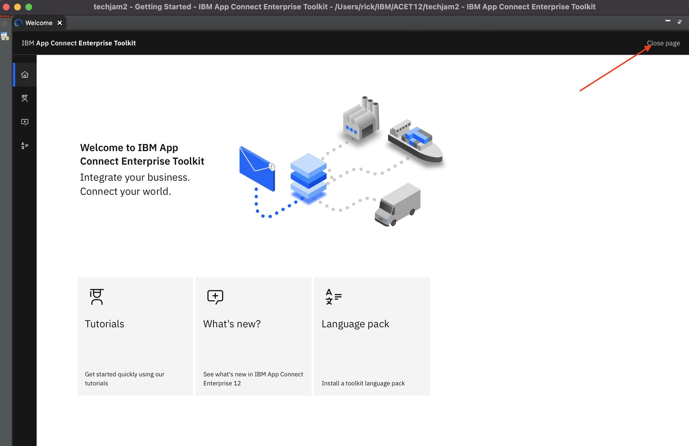
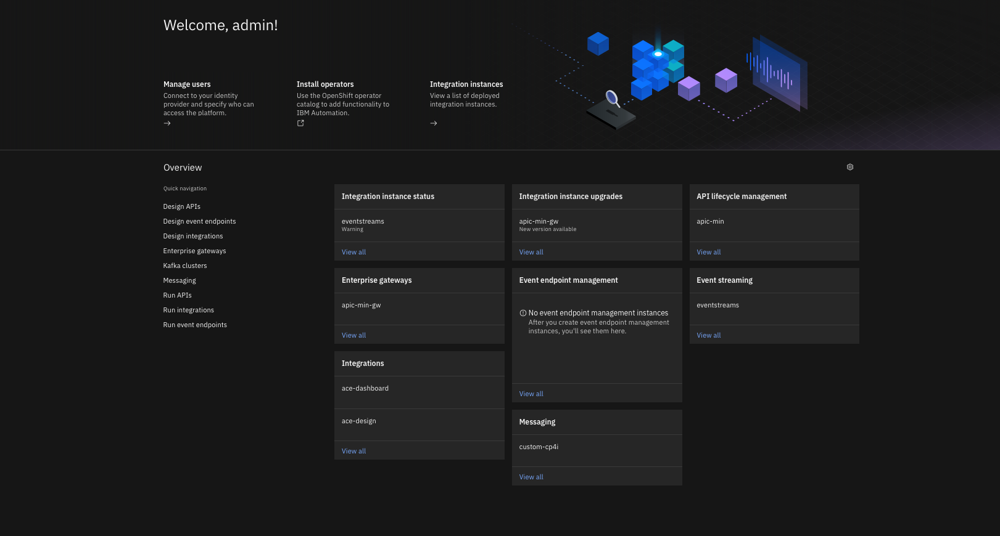
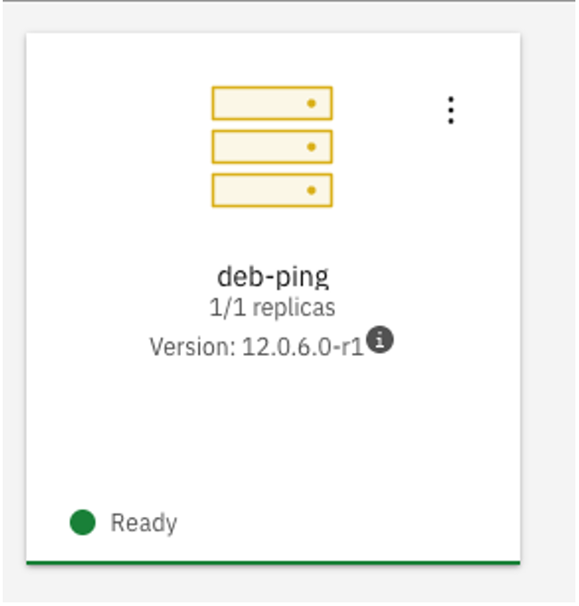

### [Return to main ACE lab page](../app-connect-enterprise)

---

# Table of Contents

1. [Objectives](#objectives)
2. [Prerequisites](#prerequisites)
3. [Getting started with Lab1](#deploy)
   1. [Integration Servers](#integration_servers)  
      i. [Configure a Local Integration Server](#conf_is)    
      ii. [Stopping and starting a local integration server](#manage_is)    
       - [Using Integration Toolkit](#toolkit_is)   
       - [Using the Administration REST API](#restapi_is) 
      
      iii. [Putting integration servers to work](#work_is)  
       - [Import PING_Basic](#ping_basic)
       - [Review PING_Basic](#ping_review)
       - [Deploy PING_Basic](#ping_deploy)
       - [Deploy PING_Basic](#ping_test)
       - [Build PING_Basic BAR file](#ping_bar_deploy)
   2. [Deploy the BAR file to Cloud Pak for Integration](#deploy_bar_cp4i)  
     i. [Test PING Basic flow on CP4I](#test_cp4i)  
 
---

## 1. Objectives 
In this lab you will learned how to:
- Create and configure an Integration Server.
- Manage Integration Server from toolkit and Web Admin Console.
- Deploy  BAR file in cp4i. 

## 2. Prerequisites 
- Reserve the lab environment. If you have not reserved the lab environment yet, then click here.
- Go through the audio presentation to get the knowledge about App connect capabilities.  
- Download IBM App Connect Enterprise for Developers. To download now, click [Download](https://www-01.ibm.com/marketing/iwm/iwm/web/pickUrxNew.do?source=swg-wmbfd).   
- Install IBM App Connect Enterprise.  
   -  Install on Windows by completing the following steps: 
    1. Unpack the software, which sets up IBM App Connect Enterprise Toolkit by extracting the downloaded .zip file into a local                directory.  
    2. Run the installation file that you downloaded by running the following command with the options that you require:
       `ACESetup12.0.n.0.exe'.
        For more information about installing IBM App Connect Enterprise on Windows, see Installing IBM App Connect Enterprise on               Windows. 
        
   - Install on Linux by completing the following steps:
    1. Create or navigate to a directory where you have write access.   
    2. Unpack the software, which sets up the IBM App Connect Enterprise Toolkit by running the following command:   
       `tar -xzvf ace-12.0.n.0.tar.gz`.   
    3. Accept the license and run the installation file that you downloaded by running the command ./ace accept license for a single            user installation or `./ace make registry global accept license` for a shared installation.
       For more information about installing IBM App Connect Enterprise on Linux, see Installing IBM App Connect Enterprise on Linux.
       
   - Install on macOS by completing the following steps:
    1. Open the installation wizard by double-clicking the installation file that you downloaded. The installation file has a name              similar to IBM App Connect Enterprise 12.0.0.x.pkg but it might be automatically renamed when you download it.
    2. Follow the instructions in the installation wizard. IBM App Connect Enterprise is installed as a standard mac application with           the name IBM App Connect Enterprise in the /Applications folder.

  - Test the toolkit instalation:    
   Windows: From the Windows Start menu, expand IBM App Connect Enterprise xx.0.0.y Developer Edition (where x denotes the version),                 then click IBM App Connect Enterprise Toolkit.
   Linux: From the command environment, type ./ace toolkit.
   macOS: Run the application /Applications/IBM App Connect Enterprise to start the toolkit.

IBM App Connect Enterprise Toolkit opens to display its welcome page.

## 3. Getting started with lab1 
## 3a. Integration Servers  

### i. Configure a Local Integration Server 

In the next section you will create a local integration server using this feature. The follow diagram shows what you will set up on your local integration server.

![alt text][images/0.png]

1\. Open the IBM App Connect Enterprise Toolkit.  From the Workspace Launcher we will create a new workspace for the work in this lab guide enter the Workspace name and click Launch.

![alt text][images/1.png]

2\. In the “**Welcome to IBM App Connect Enterprise Toolkit**” window click Close page:

![alt text][images/2.png]

3\. The Eclipse based **Integration Toolkit** will open:

![alt text][images/3.png]

A)	**The Application Development** window <b>(A)</b> is where your Applications, REST APIs, etc. will be shown in your workspace

B)	Window <b>(B)</b> is where resources that you open (for example message flows) will be shown.

C)	Window <b>(C)</b> is where properties of resources that you highlight in window <b>(B)</b> can be viewed

D)	The **Integration Explorer** Window <b>(D)</b> is where you can view and manage deployed  assets (for example Applications and Message flows). Note assets are deployed to Integration Servers that are optionally managed by an Integration Node. When they are managed by an integration node the integration servers will appear “under” an integration node in this view. When not managed by an integration node they will be found under the “**Integration Servers**” view in this window.

4\. In the **Integration Explorer** window <b>(D)</b> right click on Integration Servers and select “Create a local Integration Server”:

![alt text][images/4.png]

5\. Accept the defaults in the “***Create and start a local Integration Server***” window and select Finish:

![alt text][images/5.png]

This will trigger a process to configure a **\<local\>** integration server (not managed by a node) and to start it.

Note: the default port for Administration of the server is 7600. Since the “**Find a currently available port for REST administration**” is ticked, the process will add one to this port number until an available port is found (*this is also the logic for the HTTP Port and JVM Debug Port*).

6\. On successful start of the local Integration Server you will see a message similar to the following. **\<Before\>** dismissing the message, note the location of the console.log file:

![alt text][images/6.png]

7\. A connection to your new local Integration Server will appear in the Integration Explorer window – the green arrow (pointing upwards) to the left of the server name indicates that the server is running:

![alt text][images/7.png]

The local Integration Server should be started (if the server isn’t started there is likely to be a problem with the default ports configured in your server.conf.yaml)

### ii. Stopping and starting a local integration server 

In this section you see different ways of how a local Integration Server can be stopped stopped and started.

#### - Using Integration Toolkit 

1\. The integration server that you created in the previous section will be up and running (it will have a green arrow facing upwards in the Integration Exlorer window. Right click on the server name and select Stop (this will stop the integration server):

![alt text][images/8.png]

2\. A message will appear explaining that the integration server is shutting down:

![alt text][images/9.png]

3\. When the integration server has shutdown, the **Integration Explorer** will show the TEST_SERVER with a red arrow pointing downwards:

![alt text][images/1.png0]

4\. In the **Integration Explorer** right click on the integration server and **\<note\>** the option to start the integration server.

![alt text][images/1.png1]

#### - Using the Administration REST API 

IBM App Connect Enterprise V11 has an extensive administration REST API that enables you to control running Servers as well as server objects and resources. In this next section you see how to review the API documentation and stop a running local integration server using this REST API.

1\. Using the Integration Explorer, Start TEST_SERVER (check the arrow is green and facing upwards):

![alt text][images/1.png2]

2\. Open a Firefox browser window and go to the following URL: [http://localhost:7600/apidocs](http://localhost:7600/apidocs)

![alt text][images/1.png3]

3\. Note the API operations on the left of the window with details of the right.

Use the filter to show the operations relating to shutdown and select the resulting **POST/apiv2/shutdown** operation to show the details of the API operation:

![alt text][images/1.png4]

Note the **Example request** and **Responses**.

4\. Click curl in the **Example request** to see examples of how to call the operation using different methods:

![alt text][images/1.png5]

For example **python**:

![alt text][images/1.png6]

5\. Click the “**Try it**” tab and then select the **Send** button (this will send the API request to the administration port on TEST_SERVER. The integration server will then shutdown:

![alt text][images/1.png7]

6\. You will see the request that was sent followed by the server’s response at the bottom of the “**Try it**” web page:

![alt text][images/1.png8]

7\. Switch to the Integration Explorer window in the Integration Toolkit and refresh the Integration Server list, note the server is now in shutdown state:

![alt text][images/1.png9]

8\. In the Integration Explorer window (in Integration Toolkit), right click on TEST_SERVER and **start** the integration server again ready for the next few sections.

![alt text][images/2.png0]

In this section you have seen how to create a local integration server from within Integration Toolkit and various options to manage stopping and starting an integration server.

### iii. Putting integration servers to work! 

You now have a integration servers running: TEST_SERVER running with defaults settings; You will now review a very simple application called PING_Basic and deploy it to integration servers you have running in your environment.

Now download the **PING_Basic_PoT_PIF.zip**
Click here and save the zip file - [PING_Basic_PoT_PIF.zip](PING_Basic_PoT_PIF.zip)

#### - Import PING_Basic 

PING_Basic is a very simple application that you will now use to see an application running on the servers you have created. In this next section you will import the application into your workspace so that you can review what it will do.

1\. With your mouse right click on the background of the Application Development window and select “**Import**”

![alt text][images/2.png1]

2\. Select **IBM Integration > Project Interchange** then click the Next button:

![alt text][images/2.png2]

Use the browse button to import the file PING_Basic_PoT.zip from where you had downloaded it.

Click **Finish**:

![alt text][images/2.png3]

4\. The **PING_Basic** Application will be imported into your workspace, expand the application to see the message flow:

![alt text][images/2.png4]

#### - Review PING_Basic 

1\. Double click on basicflow.msgflow, this will open the message flow in window <b>(B)</b>. This flow has two paths.   For this lab we will be focused on the HTTP Input.

![alt text][images/2.png5]

2\. Double click on the node called “Compute” to see the data that will be returned from the http request when the message flow us started:

The flow will return the following:

Set OutputRoot.JSON.Data.pingbasic.Server = ExecutionGroupLabel;

Set  OutputRoot.JSON.Data.pingbasic.WorkPath = WorkPath;

Set  OutputRoot.JSON.Data.pingbasic.MsgFlow = MessageFlowLabel;

Set  OutputRoot.JSON.Data.pingbasic.DateTime = CURRENT_TIMESTAMP;

ie The **server name** that the flow is running on;the **WorkPath** of the server; the **message flow name**; the **current time** stamp;

3\. Close the esql editor and the message flow without making any changes:

![alt text][images/2.png6]

#### - Deploy PING_Basic

1\. Right click on the **PING_Basic** application and select **Deploy**.

![alt text][images/2.png7]

2\. When prompted to choose an integration server, deploy the application to **TEST_SERVER**.

![alt text][images/2.png8]

3\. Review the deploy messages and dismiss the Progress information window by pressing the close button (*note this new window in FP8 is very useful if you receive errors on the deploy*):

![alt text][images/2.png9]

4\. The PING_Basic application will appear in the TEST_SERVER :

![alt text][images/2.png9a]

#### Test PING_Basic 

1\. Open a new tab in your Firefox browser window, and go to the followin URL:

[http://localhost:7800/PING_Basic](http://localhost:7800/PING_Basic)

the request should return details of TEST_SERVER:

![alt text][images/3.png0]

#### - Build PING_Basic BAR file 

Create a BAR file in order to deploy the solution to the Cloud Pak for integration server

1\. In the ACE Toolkit, right click on the Application Development window and select **New> BAR file**. Call the BAR file **PING_Basic**. Click Finish to create the BAR file.

2\. When the BAR file editor opens, select the **PING_Basic** Application, select the compile and in-line resources, then click “**Build and Save**”:

![alt text][images/3.png1]

3\. Ensure the build completes successfully and dismiss the message:

![alt text][images/3.png2]

4\. Save the bar file you build.  We will upload this to the Cloud Pak for Integration in the next lab.

![alt text][images/3.png3]

## 3b. Deploy the BAR file to Cloud Pak for Integration 

With the Toolkit you can build powerful and complex integration applications, services, and APIs quickly and easily using a visual designer. Your integration solutions can be directly deployed to the Cloud Pak for Integration on IBM Cloud Pak running on-premises, in any cloud, or combinations of both.

In this next section you will deploy the PING_Basic bar file created and tested in the toolkit in the last section to the Cloud Pak for Integration.

1\. Open a  browser window and go to the URL for CP4I Platform Navigator. Refer [FAQs](https://ibmintegration.github.io/jam-in-a-box/faq) to understand how to access your enviroment.

2\. Log in page:

3\. When prompted use the username(admin) and password provided to you for this lab.

4\. This is the **CP4I Platform Navigator** page and shows all the capliblies that are installed:

5\. In the upper right cornor click on the icon to see who you are logged in as. Then we will select the **Integration Dashboard**

![alt text][images/3.png7]

6\. This will take you to the IBM App Connect Home page.  Select the ***Create a server tile***

![alt text][images/3.png9]

8\. This will take you to the first step of creating an integration server.  We will select the Toolkit integration and clidk Next: (***We will cover the Designer Integration in other labs***)

![alt text][images/4.png0]

9\. We will now select our BAR file either by drag and drop it or upload it.  The click **next**

![alt text][images/4.png1]

10\. The next page is for any configurations that need to be applied to the integration server.  For this one just click “**Next**”

11\. Now we will use the UI to set all the details for this integration server.
We will set the name to **is-toolkit1**, **Replicas** to **1** and then select **Create**

12\. This will take you to the Servers page.   You will see the integration server we just created and it will show Unavailable till the containers are started.
After a little bit refresh the page.  Once the server is up and running it will show as **Started**

### i. Test PING Basic flow on CP4I 

We will now test the PING_Base flow we just deployed to CP4I in the Integration Server

1\. Open a new firefox browser window and enter the following address:
In this example we are using the **mandalorian** cluster and **mandalorian1 userid**

[http://is-toolkit-basic-http-mandalorianNN.apps.mandalorian.coc-ibm.com/PING_Basic ](http://is-toolkit-basic-http-mandalorianNN.apps.mandalorian.coc-ibm.com/PING_Basic )

Where: is-toolkit1-basic  is the *name of your server* you deployed the flow and the 9 will be the *number that you were assigned for the lab*.

2\. You should see something simialr to the following:

![alt text][images/4.png4]

### [Return to main ACE lab page](../app-connect-enterprise)

[images/0.png]: images/0.png
[images/1.png]: images/1.png
[images/2.png]: images/2.png
[images/3.png]: images/3.png
[images/4.png]: images/4.png
[images/5.png]: images/5.png
[images/6.png]: images/6.png
[images/7.png]: images/7.png
[images/8.png]: images/8.png
[images/9.png]: images/9.png
[images/1.png0]: images/10.png
[images/1.png1]: images/11.png
[images/1.png2]: images/12.png
[images/1.png3]: images/13.png
[images/1.png4]: images/14.png
[images/1.png5]: images/15.png
[images/1.png6]: images/16.png
[images/1.png7]: images/17.png
[images/1.png8]: images/18.png
[images/1.png9]: images/19.png
[images/2.png0]: images/20.png
[images/2.png1]: images/21.png
[images/2.png2]: images/22.png
[images/2.png3]: images/23.png
[images/2.png4]: images/24.png
[images/2.png5]: images/25.png
[images/2.png6]: images/26.png
[images/2.png7]: images/27.png
[images/2.png8]: images/28.png
[images/2.png9]: images/29.png
[images/2.png9a]: images/29a.png
[images/3.png0]: images/30.png
[images/3.png1]: images/31.png
[images/3.png2]: images/32.png
[images/3.png3]: images/33.png
[images/3.png4]: images/34.png
[images/3.png5]: images/35.png
[images/3.png6]: images/36.png
[images/3.png7]: images/37.png
[images/3.png8]: images/38.png
[images/3.png9]: images/39.png
[images/4.png0]: images/40.png
[images/4.png1]: images/41.png
[images/4.png2]: images/42.png
[images/4.png3]: images/43.png
[//]: #
[//]: #
[images/4.png4]: images/44.png
