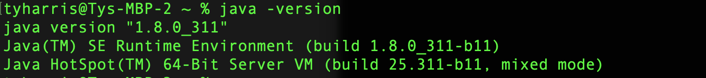
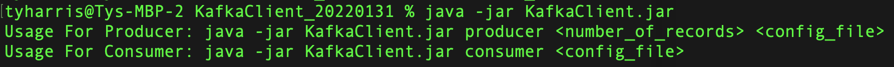

### [Return to main EventStreams lab page](../event-streams)

---

# Table of Contents
1. [Objectives](#objectives)
2. [Prerequisites](#prerequisites)
3. [Getting started with Lab1](#deploy)

---

## 1. Objectives 

In this lab you will learned how to:

-   Set up the sample Kafka Client to be used for the lab.

## 2. Prerequisites 

- Reserve the lab environment. If you have not reserved the lab environment yet, then click [here](https://techzone.ibm.com/collection/jam-in-a-box-for-the-integration-automation-cp4i/environments). 

- Go through the audio presentation to get the knowledge about IBM EventStreams capabilities. Click [here](https://ibm.ent.box.com/file/1248657353530) 

## 3. Getting started with lab1 

This section provides the instructions for setting up the Kafka Client that will be used throughout the labs.

1\.	Check java install
    `C:\Users\rajan>java -version`

   

    At least version 1.8 should be available.
    If it’s not installed, download and install the Java Runtime. https://www.java.com/en/download/manual.jsp

2\.	Download the sample Kafka Client from here:  

    https://ibm.box.com/shared/static/ogvj2jwgh7c505oj58w2kjgh4ypo3x09.zip 
     
3\.	Unzip the downloaded Kafka Client (KafkaClient_YYYYMMDD.zip) into a folder called 
    `C:\TechJam\EventStreams_Lab\`
    
4\.	Test the client
    Open a Command Prompt.
    `cd C:\TechJam\EventStreams_Lab\KafkaClient_YYYYMMDD\java -jar KafkaClient.jar`

   

### [Return to main EventStreams lab page](../event-streams)
