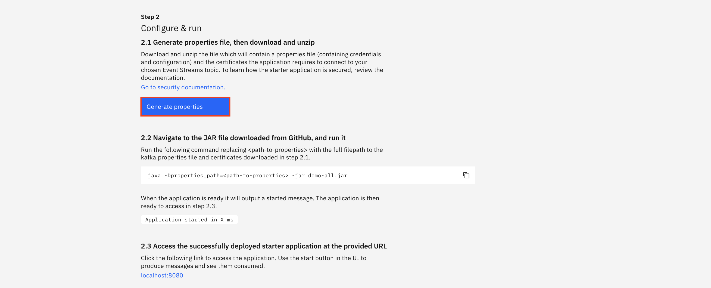
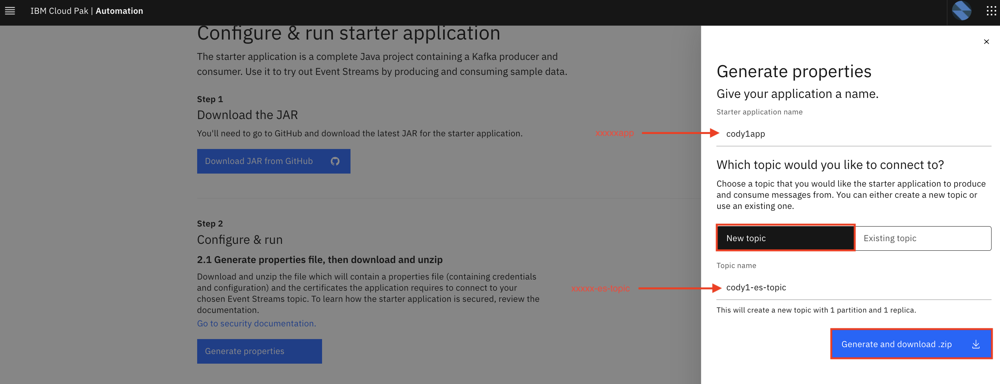
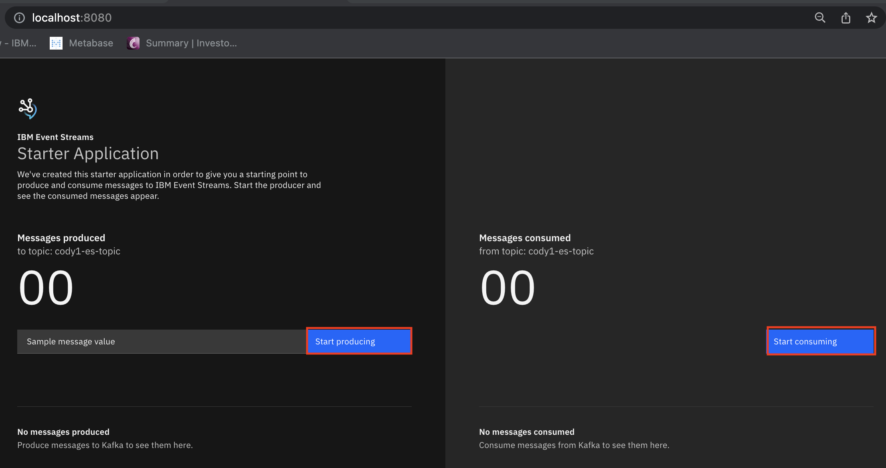
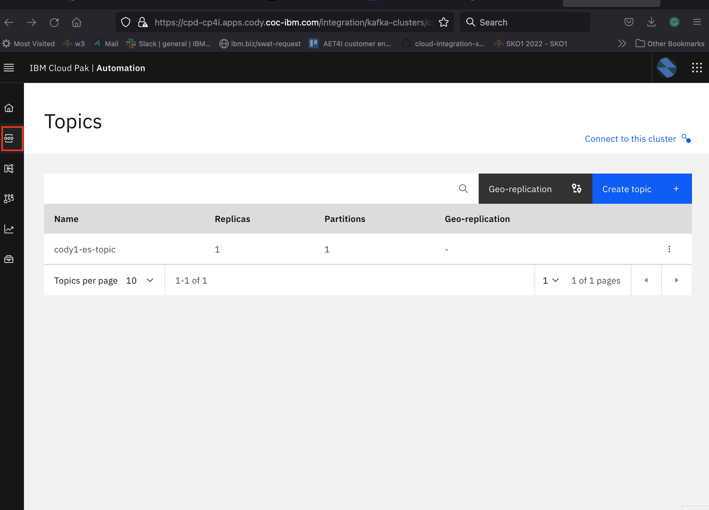

### [Return to main EventStreams lab page](../event-streams)

---

# Table of Contents
1. [Objectives](#objectives)
2. [Prerequisites](#prerequisites)
3. [Getting started with Lab2](#deploy)
    1. [Step-by-step guide ](#instruction)

---

## 1. Objectives 

In this lab you will learned how to:

- Step-by-step process to download and install our Starter Apache Kafka application.
- Run an Apache Kafka Java application that has both a producer and consumer.
- View consumer and producer message traffic in IBM Event Streams console.
- Specifying the topic within IBM Event Streams and then connecting an Apache Kafka application to produce and consume messages to and from that topic.

## 2. Prerequisites 

- Reserve the lab environment. If you have not reserved the lab environment yet, then click [here](https://techzone.ibm.com/collection/jam-in-a-box-for-the-integration-automation-cp4i/environments)
- Go through the presentation to get the knowledge about IBM EventStreams capabilities. Click [here](https://ibm.box.com/s/326ddepzvqxu96fuw3m151vadjpyqcym)
- IBM Event Streams version 10.5.0.  
- Apache Kafka 2.8.1.
- Java version 8 or 11. 
- Java version 8 installed on local environment.  
- Apache Maven Installed on local environment.  

## 3. Getting started with lab2 

IBM Event Streams is based on years of operational expertise that IBM has gained from running Apache Kafka® for enterprises. IBM Event Streams offers enterprise-grade security, scalability, and reliability running on Red Hat® OpenShift® Container Platform as certified container software. Building an event-driven architecture with IBM Event Streams allows organizations to transition from traditional monolith systems and silos to modern micro-services and event streaming applications that increase their agility and accelerate their time to innovation.
IBM Event Streams builds on top of open-source Apache Kafka® to offer enterprise-grade event streaming capabilities. The following features are included as part of IBM Event Streams:  
- Identity and Access Management (IAM) offers fine-grain security controls to manage the access that you want to grant each user for Kafka clusters, Topics, Consumer Groups, Producers, and more.
- Geo-replication enables the deployment of multiple Event Stream instances in different locations and the synchronization of data between your clusters to improve service availability.
- Visual driven management and monitoring experience with the Event Streams dashboard that displays metrics collected from the cluster, Kafka brokers, messages, consumers, and producers to provide health check information and options to resolve issues.

**Note**: The starter application also includes a user interface to easily view message propagation. The source code is provided in GitHub to allow you to understand the elements required to create your own Kafka application.
App details: https://ibm.github.io/event-streams/getting-started/generating-starter-app/
The API keys generated for the starter application can only be used to connect to the topic selected during generation. In addition, the consumer API key can only be used to connect with a consumer group ID set to the name of the generated application.

## 3a. Step-by-step guide 

1\. Log into your Event Streams instance using the student credentials provided. Once you've logged in, you'll see the Event Streams homepage.  
    
   
2\. Select “Try the starter application” tile.
    
3\. Create a working directory on your local drive then select the “Download JAR from GitHub” tab. You’ll want the demo-all.jar file for release 1.1.3.
   
4\. Copy the downloaded .jar file to your working directory.
   
5\.	Now let’s generate and download our properties file. Select the “Generate properties” tab. 
    
6\.	Enter a name of your app. For guidance, the prefix should be your login ID similar to the example below (i.e. cody1app). This will help us identify which apps are running and who is the owner. Select the “New topic” tab and enter a topic name. Again, use your login ID as the prefix for your topic name. Now select the “Generate and download .zip” tab.
    
7\.	Extract the downloaded .zip file in your working directory. Copy the properties file and p12 file to your working directory. 
    
8\.	Open a terminal and navigate to your working directory. Enter the following command:
java -Dproperties_path=./ -jar demo-all.jar
    
         	
9\.	After your applications starts, open a browser, and enter:
localhost:8080 
    
10\.	Select the “Start Producing” and “Start Consuming” tabs. 
    
11\.	You should soon see messages being produced and consumed.  
    
12\.	Now, let’s check our Event Streams cluster to verify our topic creation and monitoring of the messages. To do this, go back to the Event Streams homepage. Select “Toolbox”.
    
13\.	Select “Home” to go to the EventStreams homepage.
    
14\.	Select “Topics” to see the topic you created in the Starter application. Click on your topic to see the Producers, Messages and Consumers.
    

### [Return to main EventStreams lab page](../event-streams)

