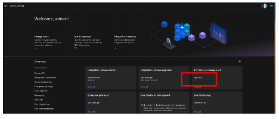

# Table of Contents
1. [How to select relevant cp4i capabilities for jam-in-a-box labs in IBM Technology Zone(TZ)?](#TZ-selection)

2. [What to expect, once TZ environment is reserved and provisioned is done?](#TZ-env-email)

3. [How to Access OCP console login and Platform Navigator login details?](#TZ-ocp-console)

4. [How to sign up with mailtrap.in?](#TZ-mailtrap)

5. [How to configure APIC provider organizational before starting the APIC labs??](#TZ-apic-porg)

6. [How to configure Developer Portal before starting the APIC labs?](TZ-apic-ptl)

---

## 1. How to select relevant cp4i capabilities for jam-in-a-box labs in IBM Technology Zone(TZ)?
When you go to the TZ environment reservation page, you will be asked to select appropriate options. 
Please select below mentioned options.

## 2. What to expect, once TZ environment is reserved and provisioned is done?

After you submit the request to reserve the environment, it will take 4 to 5 hours to provisioned and installed CP4I above mentioned capabilities.
Once environment is available to use, you will receive an email with all the details. Below is a sample.

## 3. How to Access OCP console login and Platform Navigator login details

Open the Pakinstaller Portal link that you have received in the email. 
Used the PakInstaller Portal Admin id and password to log in. Once loged in you will see something simile to below screenshot.

Click on “Openshift Console” tab. You will find ocp console log in details.

Click on Cloud Pak Status tab, You will see all the installed packages version details.

Click on “Cloud Pak Console” tab, you will find Platform Navigator log in details.

## 4. How to sign up with mailtrap.in?

1.	Go to https://mailtrap.io
2.	Sign up as new user if you do have an account with mailtrap.
3.	Once you logged into the mailtrap then you client on Inboxed->under SMTP settings, click on “Hide Credential. You will find SMTP Host, Username, Password that you will be needing to configure your SMTP server in APIC cloud manager(Detailed instructions are below.

How to configure APIC provider organizational before starting the APIC labs?

## 5. How to configure APIC provider organizational before starting the APIC labs?e

1.	Login to **Platform Navigator** by using the user id ( as admin )and password that you have collected before. 

2.	Click on **Integration instances**

3.	Click on apic-min Api management administrator.

4.	Select “Common Service User Registry”

5.	Click on” **Resources**”

6.	Click on “**Notification**”

7.	Click on edit **“Dummy Mail Server”**

8.	Used the SMTP server details that you have collected during mailtrap set up to configure the e-mail server. Save the configuration, If you want to test it, click on **Test email**.

9.	Next, create the provider organization. Go to the cloud manager home page by clicking on the **home** icom (1) at the top left, Then click on **Provider Organization**(2). Now click on Add (3) to **Create organization**.

10.	You can choose any email id you want, i showed an example(1)  in the screenshot below. Save  the **user**  (2) and **password** (3), you need that to login to the **API management**.

## 6. How to configure Developer Portal before starting the APIC labs?

1. Go back to **Platform Navigator** console and click on **API management** instance.

2.	Select API Manager User Registry.

3.	Use the username and password that you have used to create the provider organization.

4.	Click on **Manager catalog **

5.	Click on **Sandbox** catalog.

6. Open the **Catalog** setting tab (1), click on **Portal** (2) and then click **Create** (3)

7. Select **portal-service** (1) as the catalog to use. Click **Create** (2)

8. Reset admin password and test developer portal url.

    
    
    a.	Once the portal is provisioned you will receive an email in your mailtrap account as mentioned in the green highlighted box (1). Below screenshot of a sample email. Click on the link and reset the admin password. 
    
       
     
     b.	From a browser window open the Portal URL (2). Accept any potential security risks that appear. 
     
       
     
     
     
    

