###  [Return to main MQ lab page](../mq)

---

# Table of Contents
1. [Objectives](#objectives)
2. [Prerequisites](#prerequisites)
3. [Getting started with Lab1](#deploy)

   1. [Deploying IBM MQ for internal consumers](#deploy_mq)
   2. [Start MQ Console](#start_mq)
   3. [Test MQ](#test_mq)


---

## 1. Objectives<a name="objectives"></a>
In this lab, you will learn how to:

- Create a MQ Instance from Platform Nevigator.

- Test the MQ QMGR for Internal Consumers.

## 2. Prerequisites<a name="prerequisites"></a>

- Reserve the lab environment. If you have not reserved the lab environment yet, then click [here](https://abc.com).

- Go through the audio presentation to get the knowledge about API connect capabilities. 


## 3. Getting Started with Lab1<a name="deploy"></a>

These instructions document how to setup MQ within Cloud Pak for Integration which is accessible from within the OpenShift Cluster. The instructions have been created using a a Red Hat OpenShift environment deployed on bare metal servers on IBM Cloud however the processa should be similar on other environments.

## 3a. Deploying IBM MQ for internal consumers<a name="deploy_mq"></a>

1\. Open the *Platform Navigator*. Click the *Enterprise LDAP* hyperlink.

   
2\. Enter the user name and password that was provided in your email to log on.
3\. Click on Integration Instances.

   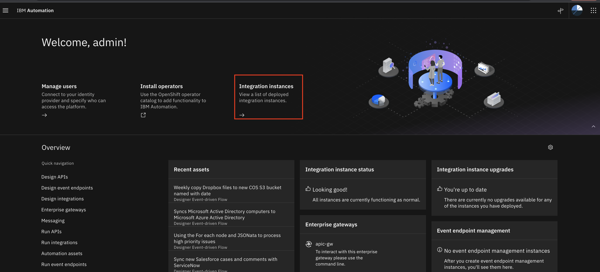
4\. Click *Create an instance to display the various runtimes available in CP4I.

   
5\. A number of tiles are displayed. Click the *Messaging* tile, then click *Next*.

   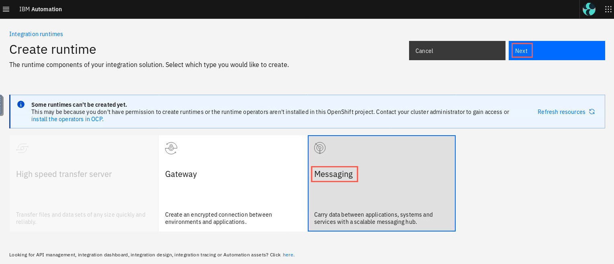
6\. You will use the option called **Quick start** which will deploy an MQ container with 1 cpu, 1 GB of memory, and measured at 0.25 vpc (Virtual Processor Core). Click the *Quick start* tile then click *Next*.

   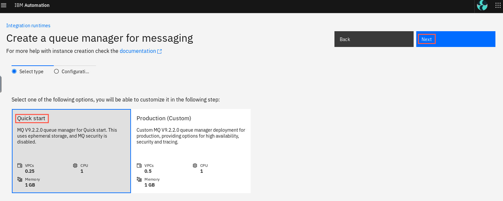
7\. On the *Create queue manager* configuration page, enter "mq" plus your student id as a prefix to the Name *quickstart-cp4i* and use the drop-down under *Namespace* to select your student namespace. Click the License acceptance button to turn it on.

   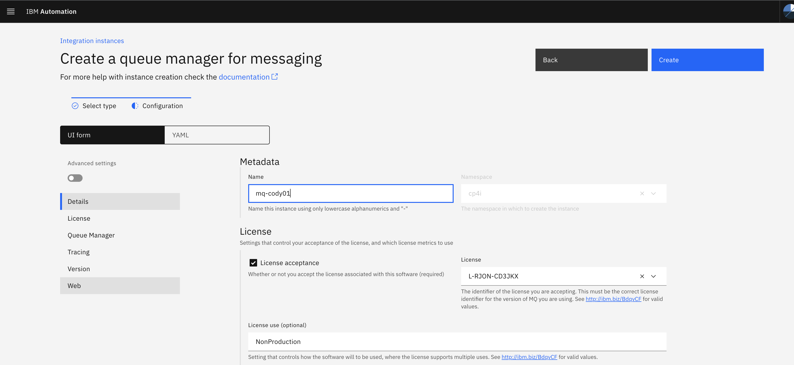
8\. Scroll down to *Queue Manager* section. Using the drop-down under *Type of availability* select **SingleInstance**. Under *Type of volume* leave the default **ephemeral**. You have a choice between ephemeral or persistent-claim. Ephemeral means that the queue manager does not maintain state so does not need persistent-storage.

   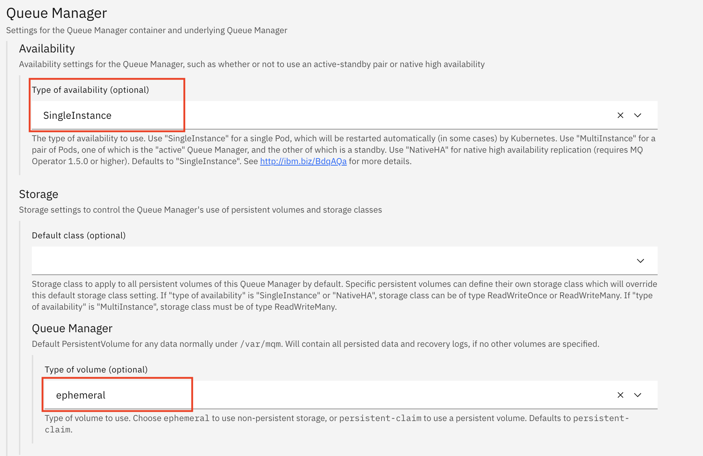

   Do NOT click Create yet. You need to name your queue manager.

   
9\. On the left side bar, click the button under *Advanced settings* to expose more settings. You may need to scroll to find the *Queue Manager* section again. Under *Advanced: Name* field you see the default **QUICKSTART**. Replace this with your queue manager name using your student ID and qm, ie **CODY01QM**.

   Now click *Create*.

   
   
10\. If all entries are valid, you will receive a notification of success in green. Any errors result in a notification in red. Status remains *Pending* while the queue manager is being provisioned. If you click *Pending* you may receive a *Conditions* pop-up. Close the pop-up. Wait for ot it change to Ready state.

    

    Click the *IBM Cloud Pak for Integration* hamburger menu on the left side bar then select **Integration Home** to return to the *Platform Navigator*.

    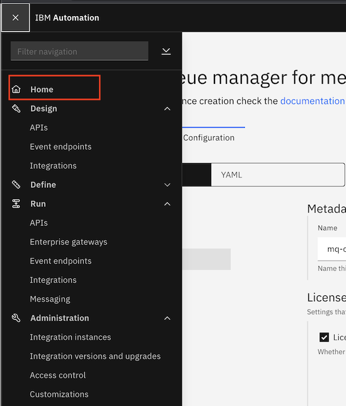
11\. Your queue manager now appears in the *Messaging* tile. Click on it.

    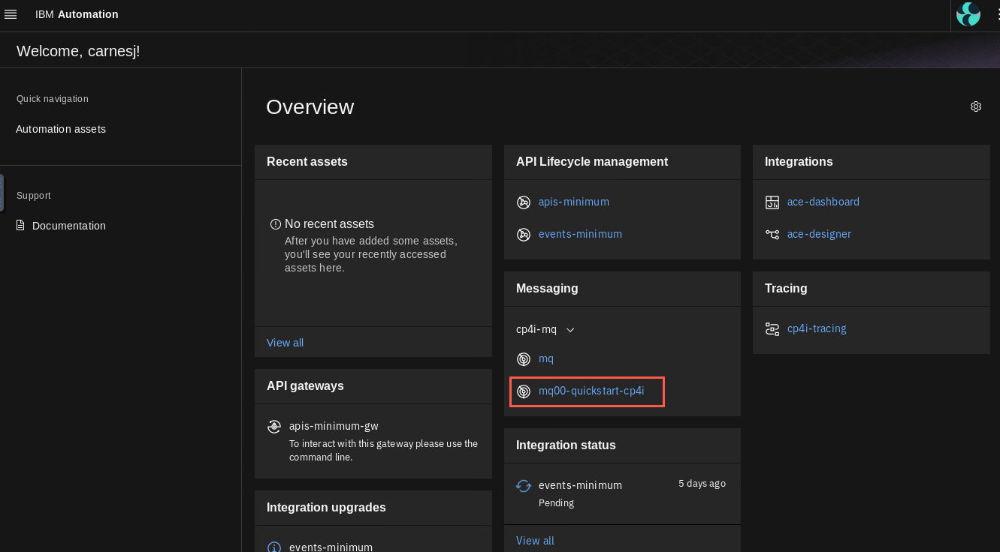

<a name="mqconsole"></a>

## 3b. Start MQ Console<a name="start_mq"></a>

The MQ Console looks nothing like MQ Explorer. It doesn't even look like earlier versions of MQ Console. Feel free to poke around (or click around) and explore the various tiles and side bar menus. When you are ready, continue to the next step - creating a queue.

1\. Click the *Create a queue* tile.

   
2\. A number of tiles are displayed for the different queue types. Behind each tile are the properties for that particular queue type. Click the tile for a *Local* queue.

   
3\. Only the required basic options are displayed with the required field *Queue name*. If you need to alter or just want to see all available options, you can click the *Custom create* tab. For now, just enter the name for the test queue **app1** and click *Create*.

   
4\. An MQ channel needs to be defined for communication into MQ. Click the *Manage* option.

   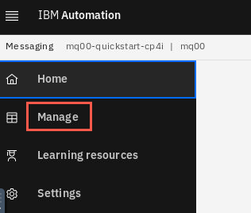
5\. Select the *Communication* tab, click *App channels*, then click *Create +*.

   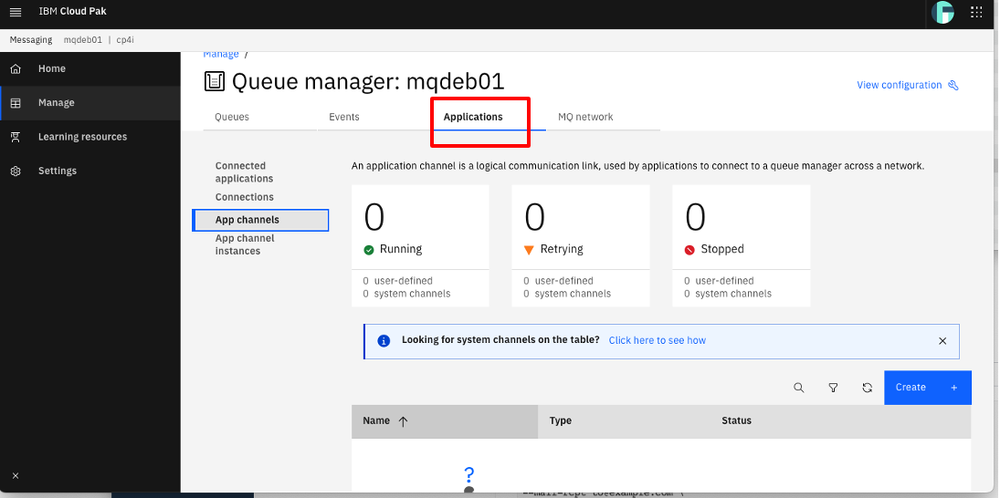
6\. Read the definition, then click *Next*.
7\. Enter "mq00qs" as channel name. *Custom create* tab lets you provide detailed properties. Click *Create*.

   
8\. You receive a green success message and the channel appears in the list.

   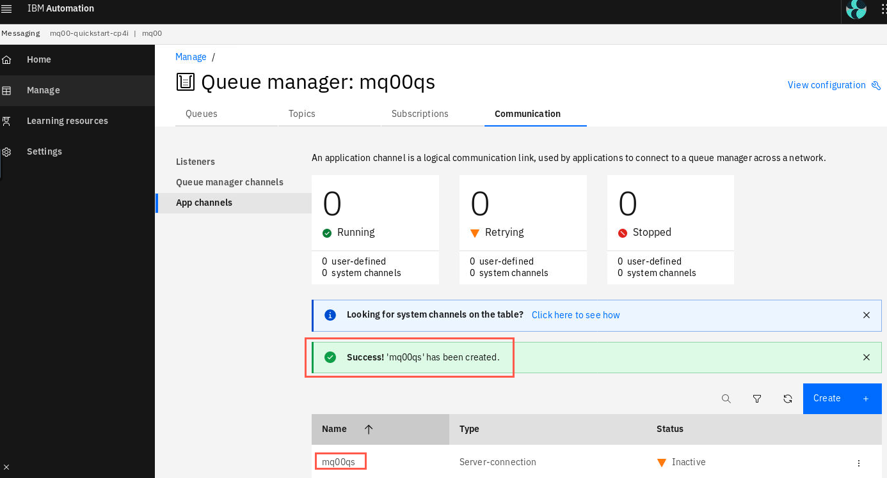
9\. By default MQ is secure and will block all communication without explicit configuration. We will allow all communication for the newly created channel. Click on *View Configuration* in the top right corner:

   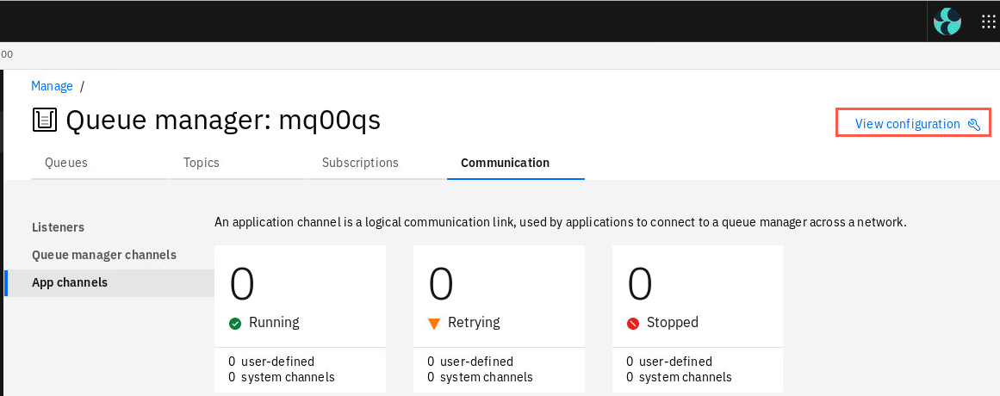
10\. Click the *Security* tab, *Channel authentication* section, then click *Create +*.

    
11\. We will create a *channel auth* record that blocks nobody and allows everyone. Select **Block** from the pull down, and click the *Final assigned user ID* tile.

    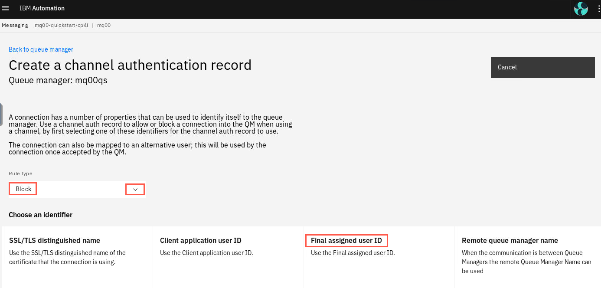
12\. For *Channel name* enter the channel name you just created. Scroll down and type  **nobody** in the *User list* field then click the "+" sign to add it.

    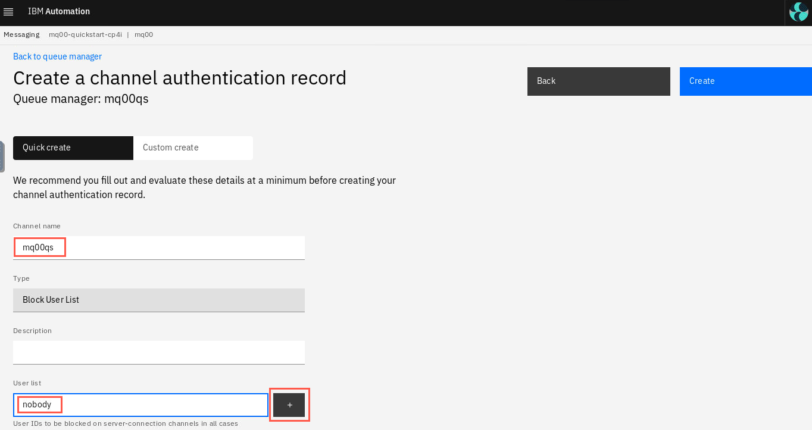
13\. Click *Create* to add the record.

    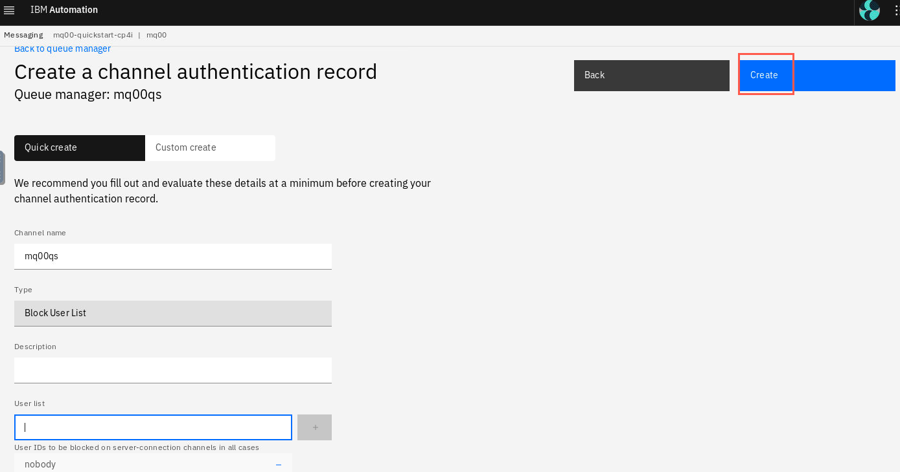
    You will receive a green succes notification and the record appears in the list.

    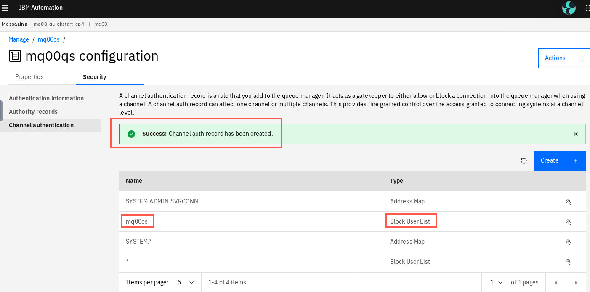

## 3c Test MQ<a name="test_mq"></a>

MQ has been deployed within the Cloud Pak for Integration to other containers deployed within the same Cluster. This deployment is NOT accessible externally. Depending on your scenario you can connect ACE / API Connect / Event Streams, etc to MQ using the deployed service. This acts as an entry point into MQ within the Kubernetes Cluster. Assuming you followed the above instructions within the deployment the hostname will be of the form mq00qs-cp4i-ibm-mq. To verify the installation we will use an MQ client sample within the deployment.

1\. Return to the OCP Console. Make sure you are in the *cp4i* namespace, by clicking *Projects*, typing **cp4i** in the filter field to find *cp4i* and clicking its hyperlink.
2\. Once in the cp4i namespace, click the drop-down for *Workloads* then select *Pods*. seach for the pod of the mq instance you created. It sill be have the name of the instance you entered in Platform Navigator while creating it plus -ibm-mq-0, for example: mq-cody01-ibm-mq-0. You will see that the *Status* is **Running** and there are three containers running in this pod.

   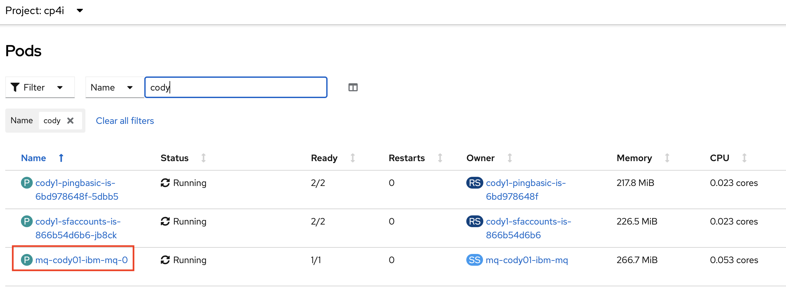
   
3\. Click the hyperlink for the pod. Now you will see quite a bit of details about the pod. Explore the details where you find graphs for memory and cpu usage, filesystem and network. Scroll down and you will find the containers and volumes. From this panel you can drill down into any of these. But for now, you need to run a test. Click the *Terminal* tab which will automatically log you into the Queue Manager container.

   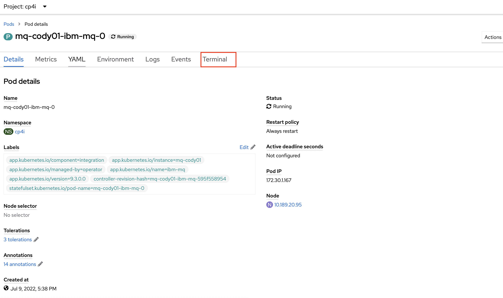
   
4\. Run the following commands to send a message to the **app1** queue. Don't forget to replace cody01 with your student ID.

   ```
   export MQSERVER='mq00qs/TCP/mq-cody01-ibm-mq-0(1414)' 
   ```

   The format of this environment variable is :
   *channel name / TCP / host name (port)*

   The host name is actually the network service for your queue manager instance.

   ```
   /opt/mqm/samp/bin/amqsputc app1 CODY01QM
   ```

   This command is putting a message on queue **app1** on queue manager **CODY01QM**.
   Type a message such as:'

   ```
   sending my first test message to qm cody01qm queue app1
   ```

   Hit enter again to end the program.

   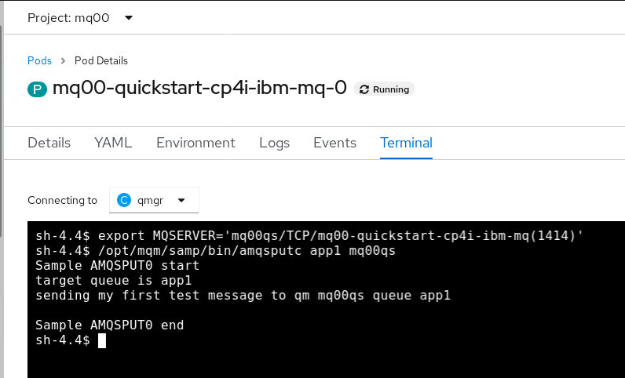
5\. Return to the MQ Console and navigate back to the queue manager view by clicking on *Manage*.

   
6\. Notice the **app1** queue has a queue depth of 1 with a maximum queue depth of 50,000. Select the *app1* queue.

   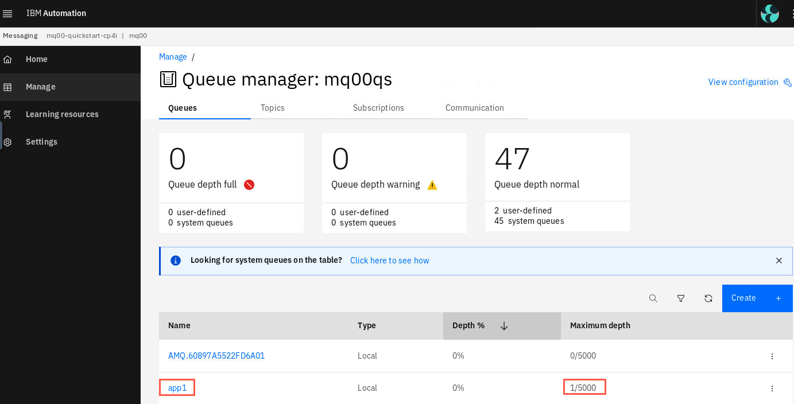
7\. Click the hyperlink for queue **app1**. Here you see the messages on the queue. You will recognize your message under *Application data* along with application name and time stamp.

   

[Return to main lab page](../mq)

